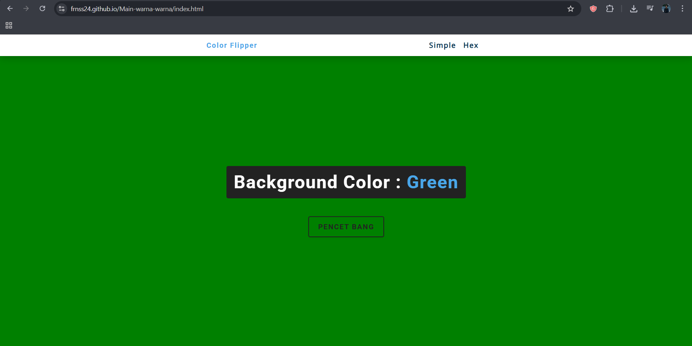

# [Color Flipper]

> [Permainan simpel untuk mengetahui hex sebuah warna.]


## 💻 Teknologi

  **Clone repository ini**
    '''
    git clone https://github.com/Frnss24/Main-warna-warna.git
    ```

Dibuat oleh **[Fransiskus]**.
